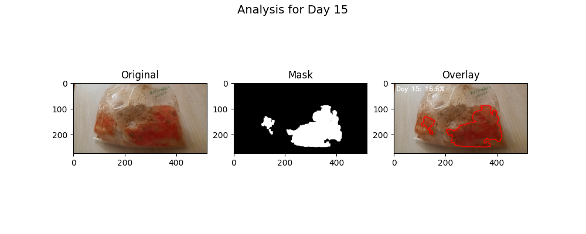
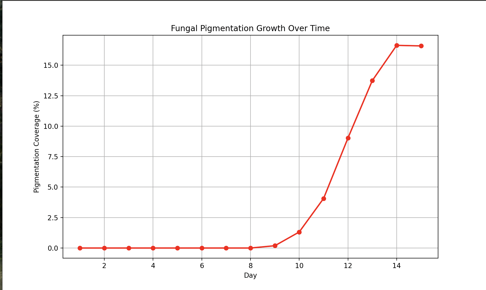

# Automated Fungal Pigmentation Analysis

**Client:** Mushloop | **Role:** Computer Vision Engineer (Freelance)

A computer vision pipeline developed to automate the quantification of fungal pigmentation growth over time. This tool processes daily time-series images of fungal cultures, isolating mycelial pigmentation from complex substrates (coconut coir/sawdust) to generate precise growth metrics and visualization reports.

## 📌 Project Overview

In agricultural and biological research, manual assessment of fungal growth is subjective and error-prone. This project automates the process using Python and OpenCV. It addresses the specific challenge of differentiating **orange/red fungal pigmentation** from **brown organic substrates**—colors that are adjacent in the spectrum—by utilizing advanced HSV color space masking and morphological filtering.

### Key Features
* **Intelligent Region of Interest (ROI):** Automatically crops images to remove non-biological noise (labels, bag knots).
* **Robust Color Segmentation:** Uses a "split-spectrum" HSV strategy to isolate specific pigment hues (Pink/Red) while aggressively filtering out substrate colors (Brown/Orange).
* **Noise Reduction:** Implements morphological opening and blob size filtering to eliminate glare, reflections, and dust particles.
* **Batch Processing:** Processes entire image directories in seconds, generating individual analysis images and a cumulative growth curve.

## 🛠️ Tech Stack

* **Language:** Python 3.x
* **Computer Vision:** OpenCV (`cv2`)
* **Data Manipulation:** NumPy
* **Visualization:** Matplotlib

## ⚙️ Installation

1. **Clone the repository:**
   ```bash
   git clone [https://github.com/yourusername/fungal-pigmentation-analysis.git](https://github.com/yourusername/fungal-pigmentation-analysis.git)
   cd fungal-pigmentation-analysis
    ```
2. **Install dependencies:** It is recommended to use a virtual environment.
    ```bash
    pip install opencv-python numpy matplotlib
    ```
3. **Directory Structure:** Ensure your project folder looks like this:
    ```
    ├── fungal_growth_images/    # Place your raw images here (day1.jpeg, day2.jpeg...)
    ├── analysis_results/        # Output folder (auto-created)
    ├── main.py                  # The script file
    └── README.md
    ```

## 🚀 Usage
1. Place your images in the fungal_growth_images folder. Ensure they are named sequentially (e.g., day1.jpeg, day2.jpeg).
2. Run the script:
    ```bash
      python __init__.py
    ```
3. The script will:
- Process each image silently in the background.
- Save detailed debug images (Original vs. Mask vs. Overlay) to analysis_results/.
- Display a Growth Curve graph.
- Display a Summary Grid showing the visual progression of all days.

## 📊 Output Samples
1. Growth Visualization
The tool generates a visual overlay where detected pigmentation is highlighted against the original image to verify accuracy.



2. Growth Curve
A quantitative plot showing the percentage of substrate covered by pigmentation over the 15-day period.


## 🧠 Methodology (The "Pink Backdoor" Strategy)
To solve the issue of the brown substrate being detected as pigment, this algorithm uses a tuned HSV approach:

Hue Gap: We specifically target the Red (0-9) and Magenta (155-180) hue ranges, intentionally skipping the Orange (10-25) range where the substrate color resides.

Saturation/Value Gating: We enforce a strict threshold (S>80, V>80) to ensure only vibrant, bright biological pigments are counted, while dull, wet dirt is ignored.

Speckle Removal: Contours smaller than 120 pixels are mathematically removed to filter out plastic bag glare.

📜 License
This project was developed for Mushloop. All rights to the biological data belong to the client. The code is provided for portfolio demonstration purposes.